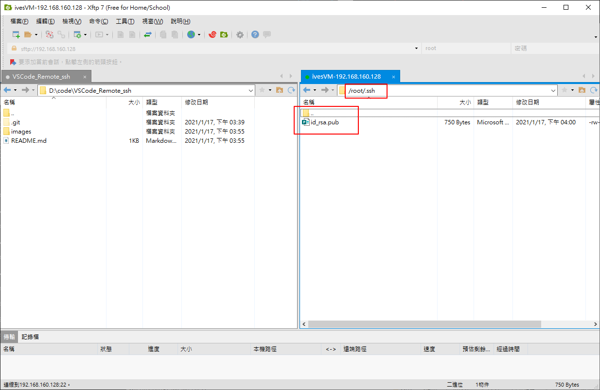

# VSCode Remote ssh

使用VSCode遠端調試CentOS系統內的程式

# 下載及安裝外掛

下載Remote SSH


# 選擇SSH Targets


# 設定config


# 選擇對應的目錄


# 看到設置檔了


# 新增自己的機器


# 開啟連結


# 選擇Linux機器

這邊按下後，繼續選擇「Continue」，再輸入自己的機器密碼


# 順利連結到ivesVM了!!


# 試著使用看看

發現雖然可以使用，但每次使用不同的資料夾，都需要再重新輸入一次密碼，真的蠻麻煩的


# 使用SSH Key的方式登入

# 在本機建立ssh key

```bash
ssh-keygen -t rsa -b 4096
```


# 產生公鑰私鑰

私鑰要自己保管好，公鑰則需要上傳到想使用的遠端機器

C:\Users\IvesShe\.ssh


# 上傳至該遠端機器

可以使用命令的方式或使用XFTP上傳

```bash
scp .\id_rsa.pub root@192.168.160.128:/root/.ssh/id_rsa.pub
```

需要注意的是，若使用命令上傳的話，要先確定該遠端機器已經有.ssh的資料夾，不然會上傳失敗


使用命令上傳成功了



# id_rsa.pub新增至authorized_keys

```bash
cat id_rsa.pub >> authorized_keys
```


# 遠端機器設定開始key登入

```bash
vi /etc/ssh/sshd_config
```

修改這三項設定

```bash
PubkeyAuthentication yes
AuthorizedKeysFile .ssh/authorized_keys
PubkeyAuthentication yes
```


重新啟動ssh登入服務

```bash
service sshd restart
```


# ssh 登入有問題的話可以google排除

http://blog.faq-book.com/?p=2782

https://my-fish-it.blogspot.com/2017/09/ss-centos-7-ssh.html

https://linux988.pixnet.net/blog/post/25926301